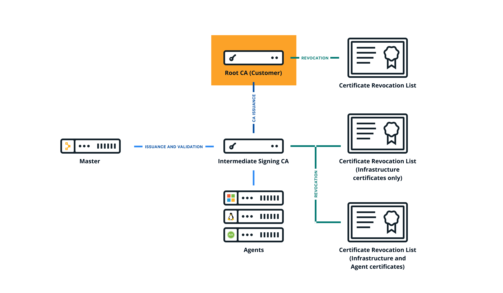

Puppet Server supports both a simple CA architecture, with a self-signed root cert that is also used as the CA signing cert; and an intermediate CA architecture, with a self-signed root that issues an intermediate CA cert used for signing incoming certificate requests. The intermediate CA architecture is preferred, because it is more secure and makes regenerating certs easier. To generate a default intermediate CA for Puppet Server, run the `puppetserver ca setup` command before starting your server for the first time.

The following diagram shows the configuration of Puppet's basic certificate infrastructure.


If you have an external certificate authority, you can create a cert chain from it, and use the `puppetserver ca import` subcommand to install the chain on your server. Puppet agents starting with Puppet 6 handle an intermediate CA setup out of the box. No need to copy files around by hand or configure CRL checking. Like `setup`, `import` needs to be run before starting your server for the first time.

**Note:** The PE installer uses the `puppetserver ca setup` command to create a root cert and an intermediate signing cert for Puppet Server. This means that in PE, the default CA is always an intermediate CA as of PE 2019.0.

**Note:** If for some reason you cannot use an intermediate CA, in Puppet Server 6 starting the server will generate a non-intermediate CA the same as it always did before the introduction of these commands. However, we don't recommend this, as using an intermediate CA provides more security and easier paths for CA regeneration. It is also the default in PE, and some recommended workflows may rely on it.

### Where to set CA configuration

All CA configuration takes place in Puppet’s config file. See the [Puppet Configuration Reference](/puppet/latest/configuration.html) for details.

## Set up Puppet as an intermediate CA with an external root

Puppet Server needs to present the full certificate chain to clients so the client can authenticate the server. You construct the certificate chain by concatenating the CA certificates, starting with the new intermediate CA certificate and descending to the root CA certificate.

The following diagram shows the configuration of Puppet's certificate infrastructure with an external root.



To set up Puppet as an intermediate CA with an external root:

1. Collect your organization’s chain of trust. This includes:
* The root cert
* Any intermediate CA certs
* The CA cert that you will use to issue a CA signing cert for your Puppet infrastructure
2. Collect the corresponding CRLs for each of these certificates.
3. Create a private key for the Puppet CA — take note of this, you will need to import it into your Puppet infrastructure later.
4. Create a CSR for the Puppet CA and sign it using the appropriate cert from your organization’s trust chain, which you gathered in Step 1. This is the new Puppet CA cert, which will be used to sign all other Puppet infrastructure certs.
5. Create a CRL for the new Puppet CA cert.
6. Concatenate all of the certs into a PEM file, starting with the new Puppet CA cert and ending with your organization’s root cert. The file should contain the PEM-encoded certs, like this:

```
-----BEGIN CERTIFICATE-----
<Puppet’s CA cert>
-----END CERTIFICATE-----
-----BEGIN CERTIFICATE-----
<Org’s intermediate CA signing cert>
-----END CERTIFICATE-----
-----BEGIN CERTIFICATE-----
<Org’s root CA cert>
-----END CERTIFICATE-----
```
7. Concatenate all of the CRLs into a PEM file, in the same order as the certificates. The file should contain the PEM-encoded CRLs, like this:

```
-----BEGIN X509 CRL-----
<Puppet’s CA CRL>
-----END X509 CRL-----
-----BEGIN X509 CRL-----
<Org’s intermediate CA CRL>
-----END X509 CRL-----
-----BEGIN X509 CRL-----
<Org’s root CA CRL>
-----END X509 CRL-----
```

8. Use the `puppetserver ca import` command to trigger the rest of the CA setup:

```
puppetserver ca import --cert-bundle ca-bundle.pem --crl-chain crls.pem --private-key puppet_ca_key.pem
```

**Note:** Puppet 5 agents still do not support intermediate CAs. If you must use a Puppet 5 agent with a new (or regenerated) Puppet 6 CA, follow the [instructions](/puppetserver/5.3/intermediate_ca_configuration.html) for setting up Puppet 5 agents for intermediate CAs.
